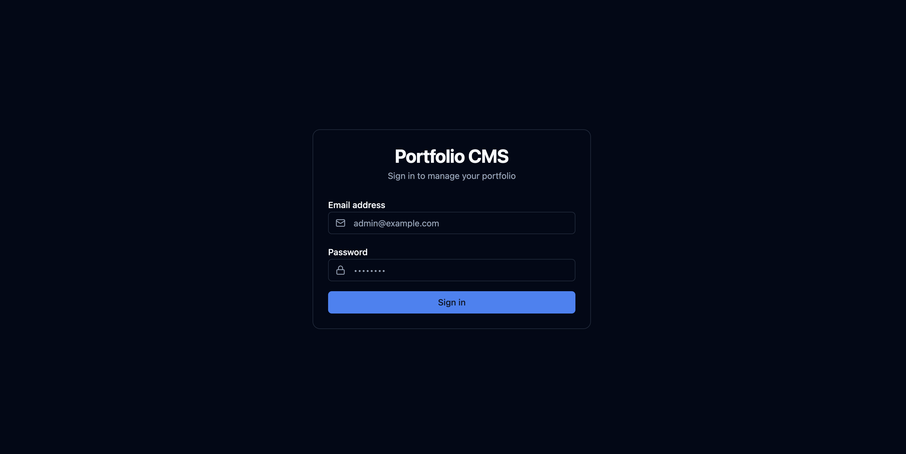
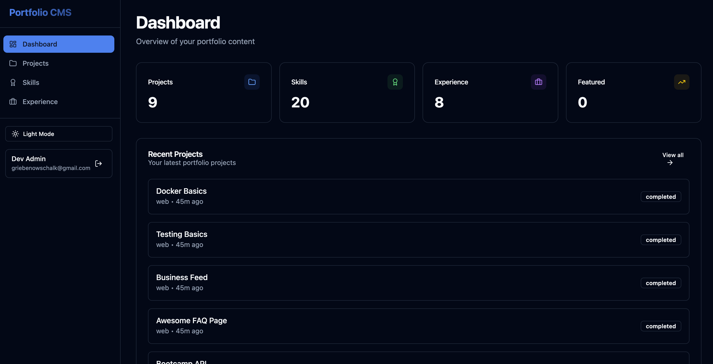
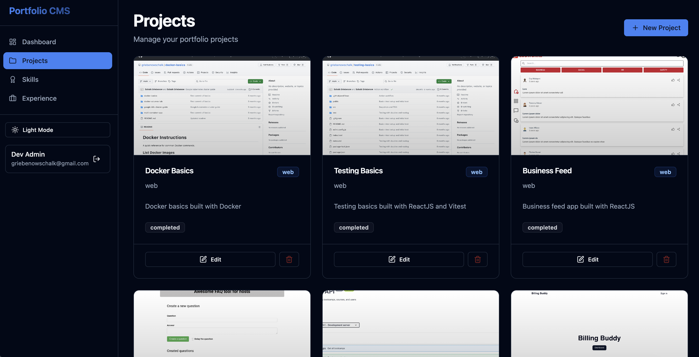
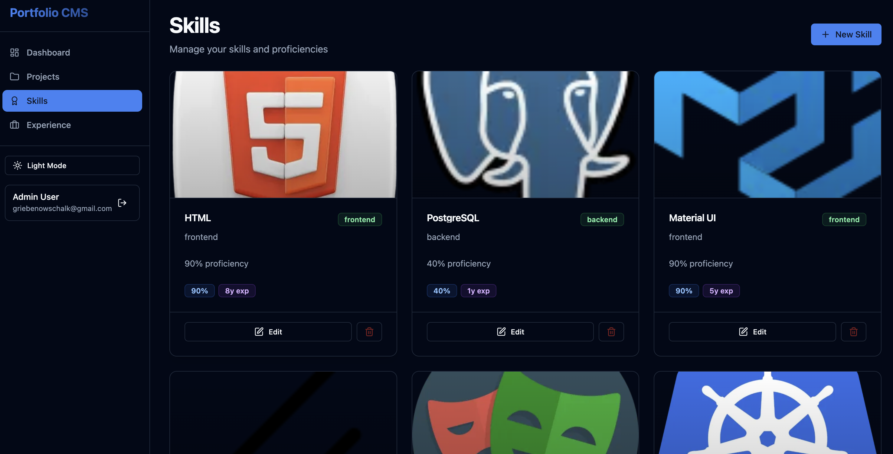
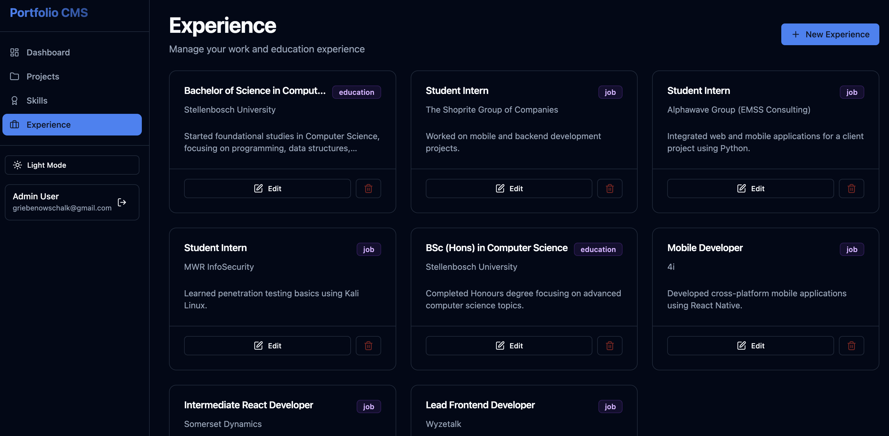
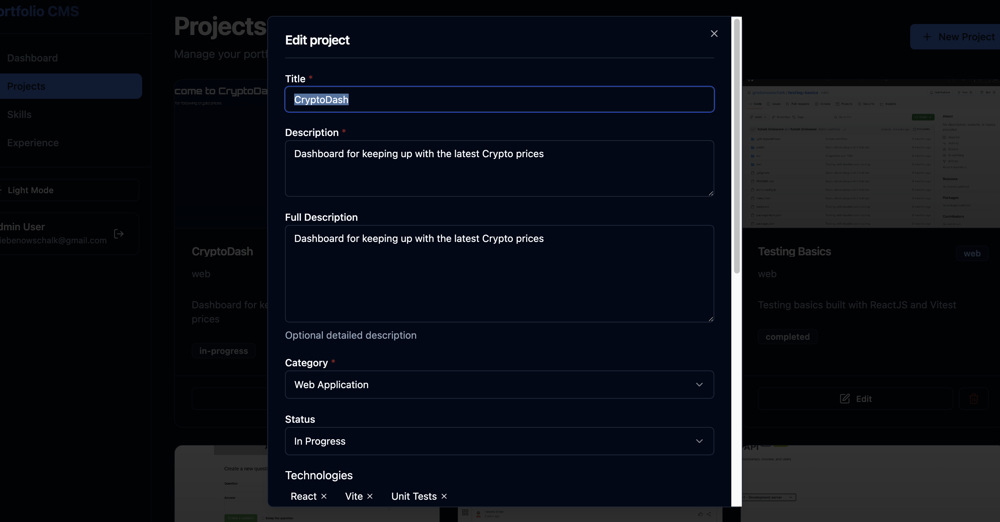
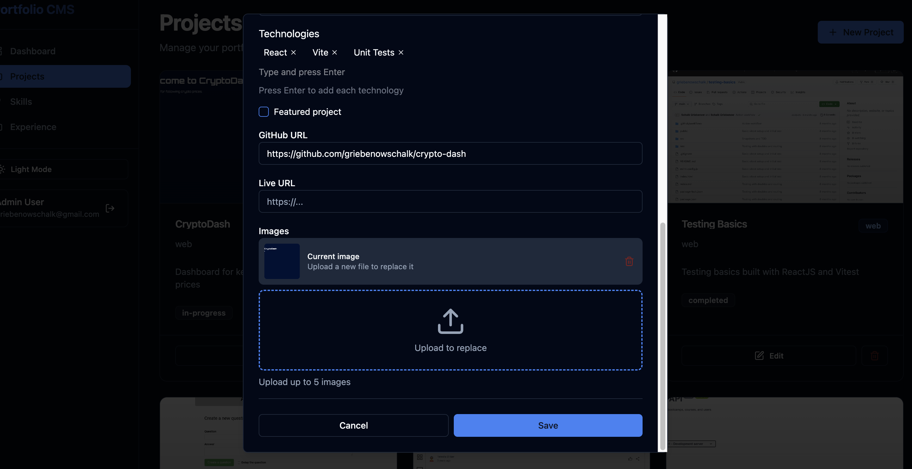

# Portfolio CMS

Admin UI for managing portfolio content: projects, skills, and experience. Uses the portfolio API for data and JWT auth.

## Screenshots

> Screenshots taken from local development build. The CMS uses a dark/light theme toggle that persists across sessions.

### Login



### Dashboard



### Projects



### Skills



### Experience



### Edit form (with image management)




---

## Development

### Run with other apps (local testing)

From the **repo root**:

1. **Start the API** (required for CMS auth and data):

   ```bash
   npm run dev:api
   ```

   API runs at `http://localhost:5002`. Optionally use Docker: from `apps/api`, `docker compose up -d`.

2. **Start the CMS**:

   ```bash
   npm run dev:cms
   ```

   CMS runs at `http://localhost:5173` (Vite default).

3. **(Optional) Start the web frontend** to verify content updates:

   ```bash
   npm run dev:web
   ```

   Web runs at `http://localhost:3000`.

### Environment

Create `apps/cms/.env.development`:

```env
VITE_API_URL=http://localhost:5002
```

If unset, the app falls back to `http://localhost:5002`. Use this to point at a different API (e.g. staging).

### Login

Use the admin user created by the API seed (e.g. from `apps/api` run `npm run seed:reset`). Credentials come from `ADMIN_EMAIL` / `ADMIN_PASSWORD` in the API env (e.g. `apps/api/.env.development`).

---

## Production

### Build

From repo root:

```bash
npm run build:cms
```

Or from `apps/cms`:

```bash
npm run build
```

Output is in `apps/cms/dist`. Serve with any static host (Vercel, Netlify, S3 + CloudFront, etc.).

### Environment

Set at **build time** (Vite inlines `import.meta.env`):

| Variable       | Description                   | Example                   |
| -------------- | ----------------------------- | ------------------------- |
| `VITE_API_URL` | Base URL of the portfolio API | `https://api.example.com` |

No trailing slash. Example for a deploy:

```bash
VITE_API_URL=https://api.yoursite.com npm run build
```

Or in your CI/CD: define `VITE_API_URL` in the environment before running `npm run build`.

### CORS

The API must allow the CMS origin in CORS (e.g. `https://cms.yoursite.com` or the domain you host the built CMS on). Configure this in the API, not in the CMS app.

### After deploy

- Users log in with the same admin credentials as in development (or whatever accounts exist in the API DB).
- The API handles auth (JWT, refresh) and storage; the CMS only needs to reach `VITE_API_URL`.
