# Image upload lifecycle (CMS -> API -> S3 -> CloudFront -> Portfolio)

This document describes the current, implemented image pipeline across the monorepo.

## End-to-end flow

```mermaid
flowchart LR
  A[CMS form submit] --> B[API multipart route]
  B --> C[multer memory storage]
  C --> D[s3Service uploadImage/uploadMultiple]
  D --> E[sharp optimize and convert to webp]
  E --> F[PutObject to S3]
  F --> G[Persist URL + key in MongoDB]
  G --> H[Web fetches /api/v1 resources]
  H --> I[Web mappers choose image URL]
  I --> J[Next Image renders from S3/CloudFront]
```

## 1) CMS sends multipart form data

- `apps/cms` uses `FormData` for writes:
  - Projects: `POST /projects`, `PUT /projects/:id`
  - Skills: `POST /skills`, `PUT /skills/:id`
- File field names are:
  - `images` for projects (multiple)
  - `icon` for skills (single)

## 2) API routes parse uploads with multer (memory)

- Project routes use `upload.array("images", 5)`.
- Skill routes use `upload.single("icon")`.
- Upload middleware keeps files in memory (`multer.memoryStorage()`), only accepts MIME types starting with `image/`, and enforces a `5MB` file size limit.

## 3) Controller delegates file processing to S3 service

- `projectController.create/update` calls `s3Service.uploadMultiple(...)` with:
  - `folder: "projects"`
  - `resize: { width: 1200, height: 800, fit: "cover" }`
  - `generateThumbnail: true`
- `skillController.create/update` calls `s3Service.uploadImage(...)` with:
  - `folder: "skills"`

## 4) S3 service transforms and uploads

`apps/api/src/services/s3Service.ts` does the heavy lifting:

- Generates UUID-based keys:
  - Main: `<folder>/<uuid>.webp`
  - Thumbnail (optional): `<folder>/thumbnails/<uuid>.webp`
- Uses `sharp` to optimize and convert to WebP.
- Uploads via AWS SDK `PutObjectCommand` with:
  - `ContentType: image/webp`
  - `CacheControl: max-age=31536000`
- Returns:
  - `url` (main image URL)
  - `thumbnailUrl` (when generated)
  - `key` (S3 object key used for deletes/replacements)

## 5) URL generation and CloudFront behavior

Image URL creation is centralized in `s3Service.getUrl(key)`:

- If `CLOUDFRONT_URL` is set, URL is: `${CLOUDFRONT_URL}/${key}`.
- Otherwise it falls back to direct S3 URL:
  `https://<bucket>.s3.<region>.amazonaws.com/<key>`.

This means distribution is automatic at runtime based on environment configuration; no code changes are needed to switch between S3 direct and CloudFront.

## 6) MongoDB persistence format

- Projects persist `images[]` entries containing:
  - `url`, `thumbnailUrl`, `key`, `alt`, `order`
- Skills persist `icon` object containing:
  - `url`, `key` (and potentially `thumbnailUrl` when provided by service shape)

The API returns those URLs in standard response envelopes (`{ success, data }`).

## 7) Portfolio web consumes and renders images

- Web fetchers call:
  - `GET /api/v1/projects`
  - `GET /api/v1/skills`
- Mappers convert API model -> UI model:
  - Project image picks first ordered image URL
  - Skill image uses `icon.url`
- Components render with `next/image`, so rendered assets are served from whichever URL API stored (CloudFront URL when configured, else S3 URL).

## Update and delete lifecycle

### Replace existing images

- Project update with new files:
  1. Fetch existing project.
  2. Delete existing S3 objects by stored keys.
  3. Upload new files.
  4. Save new image metadata.
- Skill update with new icon:
  1. Fetch existing skill.
  2. Delete old icon key if it exists.
  3. Upload new icon.
  4. Save new icon metadata.

### Remove without replacement

- Skills: `remove_icon=true` unsets icon and deletes existing S3 object.
- Projects: `remove_images=true` clears image array and deletes all existing S3 objects.

### Delete entity

- Deleting a project deletes each image key from S3 before removing the DB record.
- Deleting a skill deletes the icon key from S3 before removing the DB record.

## Environment variables involved

- `AWS_ACCESS_KEY_ID`
- `AWS_SECRET_ACCESS_KEY`
- `AWS_REGION`
- `AWS_BUCKET_NAME`
- `CLOUDFRONT_URL` (optional, but recommended in production)

## Operational notes

- Because uploaded objects are content-addressed with UUID filenames, long cache TTL (`max-age=31536000`) is safe for replaced assets (new upload -> new key).
- If a CDN URL is not appearing in returned data, verify `CLOUDFRONT_URL` in the API runtime env and restart/redeploy API.
- If portfolio images fail to render in Next.js, ensure external image hostnames are allowed in `apps/web/next.config.ts`.
